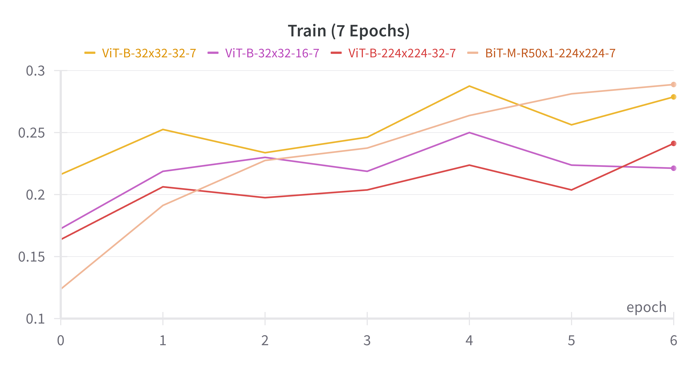

# Vision Transformer (ViT) and Hybrid Models

## Project Overview

This project focuses on implementing and comparing various models including Vision Transformers (ViT), ResNets, and Hybrid models that combine the features of both. The aim is to understand their performance in terms of accuracy, F1 score, and GPU memory usage.

## Models Implemented

- **Vision Transformer (ViT) Models**:
  - ViT-B-224x224-16-7
  - ViT-B-32x32-32-7
  - ViT-B-32x32-16-7
  - ViT-B-224x224-32-7
  - ViT-L-32x32-16-14
- **ResNet Models**:
  - BiT-M-R50x1-32x32-7
  - BiT-M-R50x1-224x224-7
  - BiT-S-R152x2-32x32-14
- **Hybrid Models**:
  - ViT(B)-Hyb-32x32-14
  - ViT-Hyb-32x32-14

## Optimizing Vision Transformer (ViT)

### Enhancements and Techniques

To improve the performance and efficiency of the standard Vision Transformer (ViT) model, the following optimizations have been implemented:

1. **LayerScale**:

   - **Description**: Applies a learnable scaling parameter to the output of each layer, improving gradient flow and stabilizing training.
   - **Implementation**: `LayerScale` class that scales the output with a learnable parameter.

2. **FlashAttention**:

   - **Description**: An optimized multi-head attention mechanism that reduces memory usage and speeds up computations.
   - **Implementation**: `FlashAttention` class for efficient multi-head attention.

3. **DropPath**:

   - **Description**: A regularization technique where entire paths (sub-networks) are randomly dropped during training, enhancing model robustness.
   - **Implementation**: `DropPath` function and class to apply the technique.

4. **FeedForward Network with GELU and Dropout**:

   - **Description**: Enhanced the feed-forward network in the transformer encoder with GELU activation and dropout for better performance and regularization.
   - **Implementation**: `FeedForward` class with these enhancements.

5. **Optimized Encoder Layer**:

   - **Description**: Integrates LayerScale, FlashAttention, and the enhanced feed-forward network for better efficiency.
   - **Implementation**: `EncoderLayer` class with the above optimizations.

6. **ViTOptimized Model**:
   - **Description**: A new ViT model incorporating all the above enhancements, making it more efficient and robust.
   - **Implementation**: `ViTOptimized` class utilizing these optimized components.

### Summary of Optimizations

These optimizations significantly enhance the model's performance by improving gradient flow, reducing memory usage, speeding up computations, and providing better regularization. The `ViTOptimized` model integrates all these techniques, resulting in a more robust and efficient Vision Transformer.

### Sample Code Snippet for Optimized Encoder Layer

```python
class EncoderLayer(nn.Module):
    def __init__(self, embed_dim: int, num_heads: int, mlp_dim: int, dropout: float = 0.1, init_values: float = 1e-5) -> None:
        super().__init__()
        self.norm1 = nn.LayerNorm(embed_dim)
        self.attn = FlashAttention(embed_dim, num_heads, dropout)
        self.ls1 = LayerScale(embed_dim, init_values)
        self.norm2 = nn.LayerNorm(embed_dim)
        self.mlp = FeedForward(embed_dim, mlp_dim, dropout)
        self.ls2 = LayerScale(embed_dim, init_values)
        self.drop_path = DropPath(dropout)

    def forward(self, x: torch.Tensor) -> torch.Tensor:
        x = x + self.drop_path(self.ls1(self.attn(self.norm1(x))))
        x = x + self.drop_path(self.ls2(self.mlp(self.norm2(x))))
        return x

## Performance Analysis

### Training Performance (7 Epochs)


- **Inference**: The BiT-M-R50x1-32x32-7 model starts lower but shows a steady increase in performance over epochs. The ViT-B-224x224-16-7 model starts at a higher performance and improves steadily with slight fluctuations.
- **Conclusion**: The ViT-B model performs better initially and maintains a lead over the BiT-M model throughout the 7 epochs.

### Training Performance Comparison (7 Epochs)



- **Inference**: Among the models compared, ViT-B-32x32-32-7 shows the highest performance increase over time, while the other models like ViT-B-32x32-16-7 and BiT-M-R50x1-224x224-7 exhibit more stable but lower performance trends.
- **Conclusion**: The ViT-B-32x32-32-7 model appears to have the best performance in this comparison, suggesting that higher embedding dimensions might be beneficial.

### F1-Score: Hybrid vs ResNets vs ViT


- **Inference**: The ViT(B)-Hyb-32x32-14 model shows consistent performance, leading to better F1 scores compared to other models. ViT-Hyb-32x32-14 and ViT-L-32x32-16-14 also perform well but have more fluctuations.
- **Conclusion**: The hybrid models show promise, particularly the ViT(B)-Hyb-32x32-14, indicating that combining ResNet and ViT features could be beneficial for overall performance.

### F1-Score: ViT vs BiT


- **Inference**: The ViT-B-32x32-16-7 model maintains a relatively high and stable F1 score compared to other models. The BiT-M-R50x1-224x224-7 shows improvement over time, eventually surpassing the ViT-B-224x224-32-7.
- **Conclusion**: The ViT-B-32x32-16-7 model is consistently high-performing, but the BiT-M model shows potential for catching up or surpassing other ViT models given more time or epochs.

### GPU Memory Allocated


- **Inference**: The ViT-L-224x224-16-14 model consumes the most GPU memory, indicating it requires more resources. Hybrid models like ViT(B)-Hyb-32x32-14 also consume significant memory but less than ViT-L models.
- **Conclusion**: While more resources are required for larger models, hybrid models provide a balanced trade-off between performance and resource consumption.

### Test Loss (7 Epochs)


- **Inference**: The BiT-M-R50x1-32x32-7 model shows a consistent decrease in test loss, indicating improving performance. ViT-B-32x32-32-7 also shows a significant drop in test loss.
- **Conclusion**: Both the BiT-M and ViT-B models are effective in reducing test loss over 7 epochs, with BiT-M being slightly more consistent.

### Test Loss (14 Epochs)


- **Inference**: Over 14 epochs, hybrid models like ViT(B)-Hyb-32x32-14 show a steady decline in test loss, outperforming others like BiT-S-R152x2-32x32-14.
- **Conclusion**: Hybrid models appear to have a significant advantage in terms of reducing test loss over longer training periods, suggesting their robustness and efficiency.

## Conclusion

- **ViT Models**: Generally show high initial performance and stable improvements over time.
- **Hybrid Models**: Demonstrate strong performance in both training and test metrics, indicating a good balance between resource usage and accuracy.
- **BiT Models**: Show consistent improvements, particularly in longer training durations, and exhibit potential to match or exceed ViT performance with sufficient training.

These inferences suggest that hybrid models leveraging both ResNet and Vision Transformer features might be a promising direction for future work. Additionally, managing resource consumption effectively while maintaining high performance is crucial for practical applications.

## Storing the Images

Store the images in the `images` folder within the project directory. The images should be named as follows:

- Train (7 Epochs): `train_7_epochs.png`
- Train (7 Epochs) Comparison: `train_7_epochs_comparison.png`
- F1-Score: Hybrid vs ResNets vs ViT: `f1_score_hybrid_vs_resnets_vs_vit.png`
- F1-Score: ViT vs BiT: `f1_score_vit_vs_bit.png`
- GPU Memory Allocated: `gpu_memory_allocated.png`
- Test Loss (7 Epochs): `test_loss_7_epochs.png`
- Test Loss (14 Epochs): `test_loss_14_epochs.png`

Ensure that the `images` directory is created in the root of your project directory and all images are stored accordingly.
```
